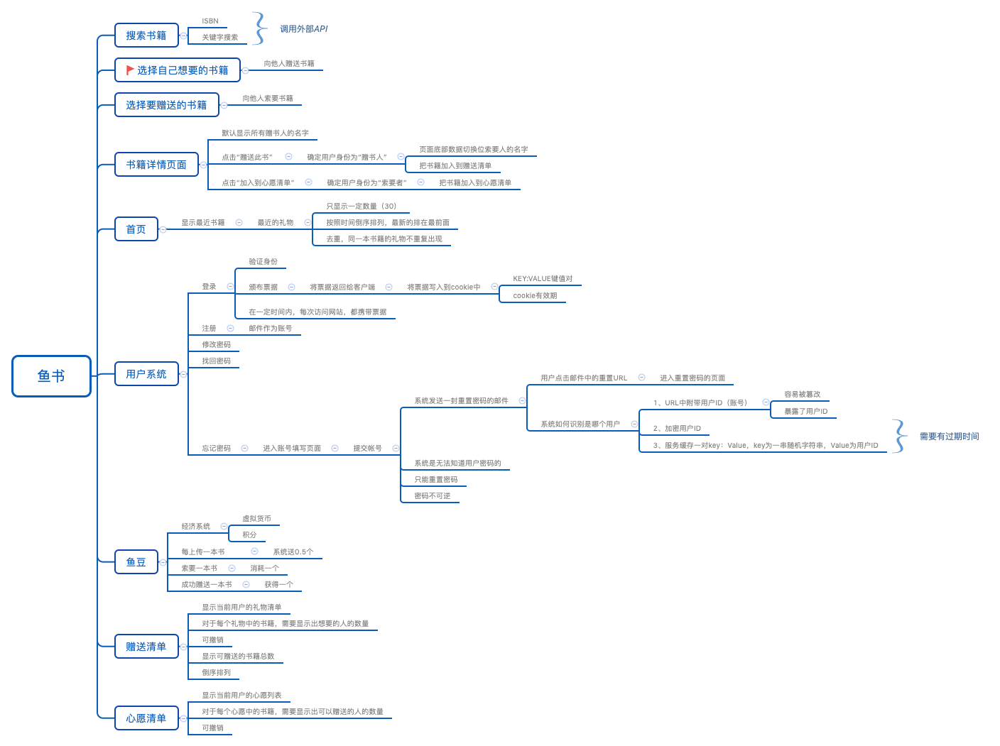
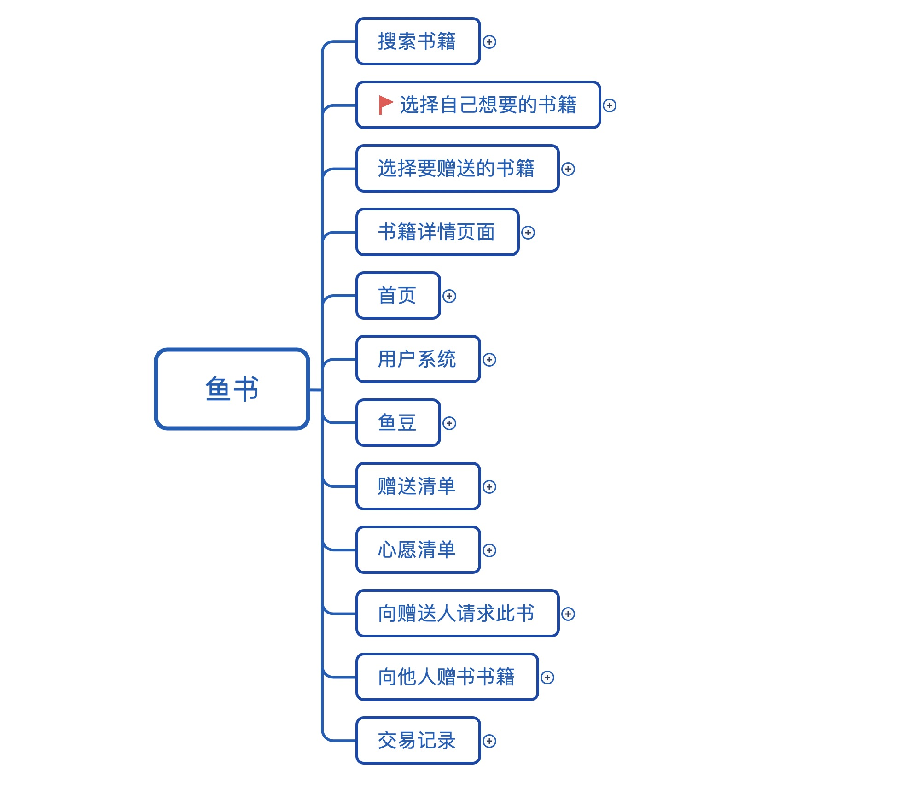

# fisher

鱼书项目：实现一个赠书和接受赠书的项目（flask高级编程项目）

### [overview]





### [Summary]

主要文件夹介绍：

- app
  - Forms:验证器相关代码
  - libs:小工具代码：如发送邮件
  - modules:DB模型
  - spider:调用API，获取书籍数据
  - static:存放静态文件
  - templates:模板文件夹
  - web:蓝图文件夹

- courses/menu.py ：记录主要功能点笔记
- courses：文件夹内,存放大致代码演进过程。

### [Python_version]:

- python_version >= "3.6"

### [packages]

- cx-Oracle==7.0.0
- cymysql==0.9.12
- Flask-Login==0.4.1
- Flask ==1.0.2
- Flask-Mail==0.9.1
- SQLAlchemy [required: >=0.8.0, installed: 1.2.14]
- PyMySQL==0.9.3
- requests==2.20.1
- urllib3 [required: >=1.21.1,<1.25, installed: 1.24.1]
- WTForms==2.2.1

### [installing]

I recommend installing in a virtualenv. to get started:

```
# create a new virtualenv
virtualenv --no-site-packages project
cd project/
source bin/activate
```

