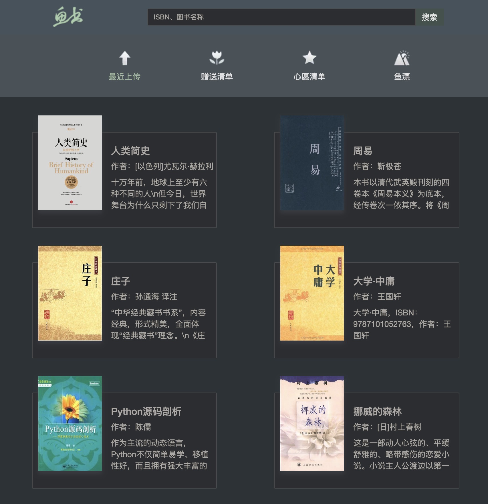

# fisher

鱼书项目：实现一个赠书和接受赠书的项目（flask高级编程项目）

### [overview]


### [Summary]

主要文件夹介绍：

- app
  - Forms:验证器相关代码
  - libs:小工具代码：如发送邮件
  - modules:DB模型
  - spider:调用API，获取书籍数据
  - static:存放静态文件
  - templates:模板文件夹
  - web:蓝图文件夹

- courses/menu.py ：记录主要功能点笔记
- courses：文件夹内,存放大致代码演进过程。
- secure.py：项目数据库配置信息
- setting.py：个人发送Email通知的配置

### [Enviroment]:

- python_version >= "3.6"
- Mysql or MariaDB

### [Packages]

- Flask-Login==0.4.1
- Flask ==1.0.2
- Flask-Mail==0.9.1
- flask_sqlalchemy [required: >=0.8.0, installed: 1.2.14]
- PyMySQL==0.9.3
- requests==2.20.1
- WTForms==2.2.1

### [Installing]

I recommend installing in a virtualenv. to get started:

```
# create a new virtualenv
virtualenv --no-site-packages project
cd project/
source bin/activate
```

### [项目在线地址]
- www.sshxtd.com
- http://139.199.131.129:5000/

### [项目首页]
